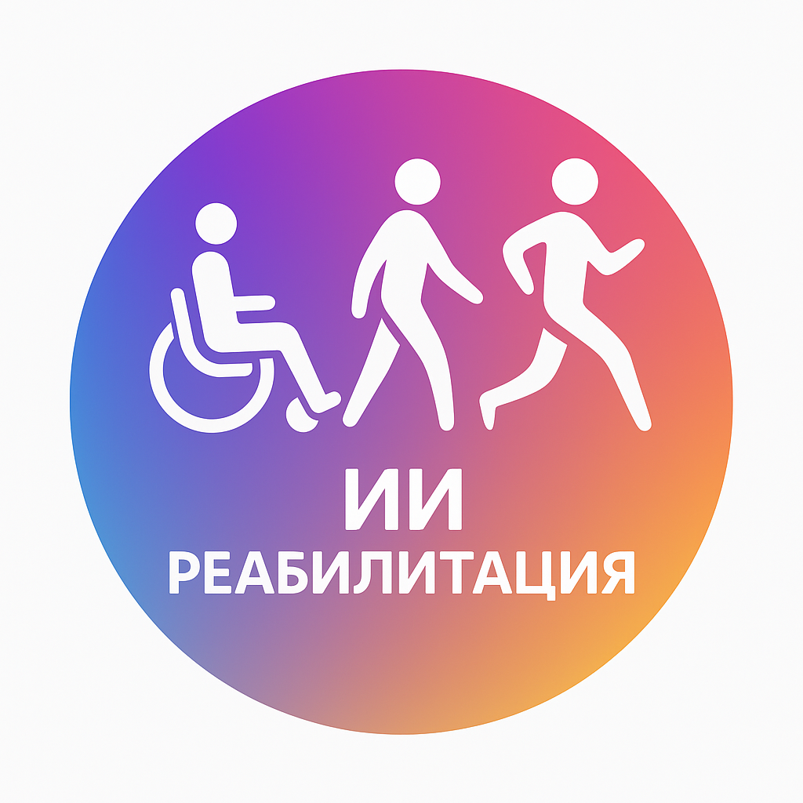

# 🌟 RehabilitationProject: Платформа для поддержки реабилитации



**API на базе FastAPI и фронтенд на React для поддержки процессов реабилитации, включая аутентификацию пользователей, создание планов реабилитации, анализ медицинских данных и обработку медицинских документов с помощью ИИ.**

---

## 📝 Описание проекта

RehabilitationProject_FA — это веб-приложение, объединяющее бэкенд на FastAPI и фронтенд на React, предназначенное для поддержки процессов реабилитации. Оно включает:
- Аутентификацию пользователей.
- Создание и управление планами реабилитации.
- Анализ медицинских данных с использованием ИИ.
- Обработку медицинских документов с помощью ИИ.

---

## 📂 Структура проекта

```
backend/: FastAPI-приложение с эндпоинтами для аутентификации, управления планами реабилитации, анализа данных и обработки медицинских документов.
frontend/: React-фронтенд для взаимодействия с API.
docker-compose.yaml: Конфигурация Docker для запуска бэкенда, фронтенда и базы данных PostgreSQL.
requirements.txt: Зависимости Python.
documents/: Папка для медицинских документов (включает copy.txt).
images/: Папка для изображений (включает rehabFA.png).
```

---

## 🚀 Установка

### Клонирование репозитория
```bash
git clone <repository-url>
cd RehabilitationProject_FA
```

### Установка зависимостей

- **Бэкенд:**
  ```bash
  pip install -r backend/requirements.txt
  ```

- **Фронтенд:**
  ```bash
  cd frontend
  npm install
  cd ..
  ```

### Настройка переменных окружения
Создайте файл `.env` в директории `backend/` с содержимым:
```plaintext
DATABASE_URL=postgresql://данные доступа к Вашей БД
GOOGLE_API_KEY=<your-google-api-key>
HUGGINGFACE_TOKEN=<your-huggingface-token>
```
- Замените `<your-google-api-key>` на ваш ключ Google API.
- Замените `<your-huggingface-token>` на ваш токен Hugging Face.

**Примечание**: Не включайте `.env` в Git. Добавьте его в `.gitignore`:
```bash
echo ".env" >> .gitignore
git add .gitignore
git commit -m "Исключение .env из отслеживания"
```

### Запуск с Docker
```bash
docker-compose up --build
```

## 🌐 Доступ к приложению

- **API бэкенда**: [http://localhost:8000](http://localhost:8000)
- **Фронтенд**: [http://localhost:3000](http://localhost:3000)
- **Документация API**: [http://localhost:8000/docs](http://localhost:8000/docs)

---

## 🛠️ Использование

### Эндпоинты бэкенда

- **POST /login-or-register**: Регистрация или вход пользователя.
- **POST /create-rehab-plan**: Создание плана реабилитации.
- **GET /rehab-plan/{user_id}**: Получение данных плана реабилитации.
- **POST /data-analysis**: Анализ медицинских данных.
- **POST /dialog**: Обработка текстовых запросов и медицинских данных с ИИ.
- **GET /model_status**: Проверка состояния моделей ИИ.

### Фронтенд

- Регистрация и вход пользователей.
- Создание и просмотр планов реабилитации.
- Анализ медицинских данных.
- Интерактивный диалог с ИИ для обработки медицинских документов.

---

## 📌 Примечания

- Убедитесь, что база данных PostgreSQL `rehab_db` инициализирована с таблицами `users` и `rehab_plan`.
- Файл `copy.txt` должен быть размещён в `/home/user/RehabilitationProject_FA/documents/` внутри контейнера бэкенда для работы RAG.
- Для работы анализа данных требуется доступ к моделям `stabilityai/stable-diffusion-xl-base-1.0` и `google/medgemma-4b-it` через Hugging Face.

---

## 🔒 Безопасность

- Не включайте чувствительные данные (например, `GOOGLE_API_KEY` или `HUGGINGFACE_TOKEN`) в отслеживаемые файлы, такие как `README.md`.
- Если токен случайно попал в репозиторий, аннулируйте его (в Google или Hugging Face) и создайте новый.
- Используйте `.gitignore` для защиты файла `.env`.

---

## 🤝 Контрибьютинг

1. Сделайте форк репозитория.
2. Создайте ветку:
   ```bash
   git checkout -b feature/ваша-фича
   ```
3. Закоммитьте изменения:
   ```bash
   git commit -m "Добавление новой фичи"
   git push origin feature/ваша-фича
   ```
4. Отправьте Pull Request на GitHub.

---

## 📧 Контакты

Для вопросов или предложений свяжитесь с автором: yanrikishi@gmail.com.
